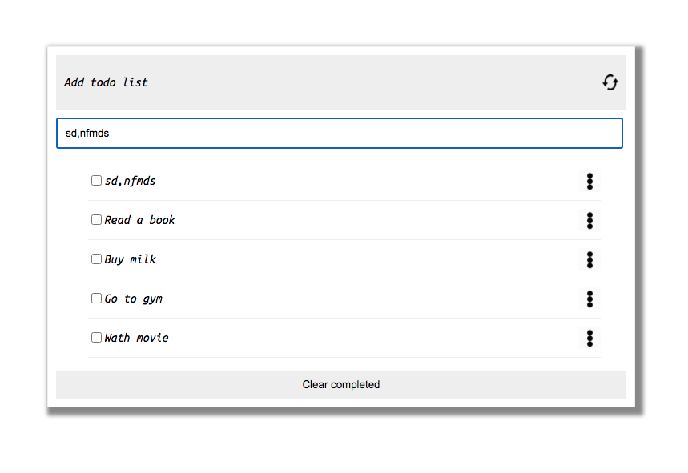

# Todo-list-webpack-config

> Sample Design of a todo List.

## Screensot

## Built With

-webpack
## Getting Started

This project is configure with webpack.
## Available Scripts

In the project directory, you can run:
### `npm install`

Installs basic  dependency for the project.
### `npm start`

Runs the app in the development mode.\
Open [http://localhost:8080](http://localhost:8080) to view it in the browser.

The page will reload if you make edits.\
You will also see any lint errors in the console.

### `npm run build`

To run Unit test run:

### `npm test`

Builds the app for production to the `dist` folder.\
It correctly bundles the app in production mode and optimizes the build for the best performance.

The build is minified and the filenames include the hashes.\
Your app is ready to be deployed!

## Live Demo

Check the [Live Demo](https://dagic-zewdu.github.io/Todo-list) deployed on github pages.
## Authors

👤 **Dagic Zewdu**

- GitHub: [@Dagic-zewdu ](https://github.com/Dagic-zewdu)

## 🤝 Contributing

Contributions, issues, and feature requests are welcome!

Feel free to check the [issues page](../../issues/).

## Show your support

Give a ⭐️ if you like this project!

## 📝 License

This project is [MIT](./LICENSE) licensed.
